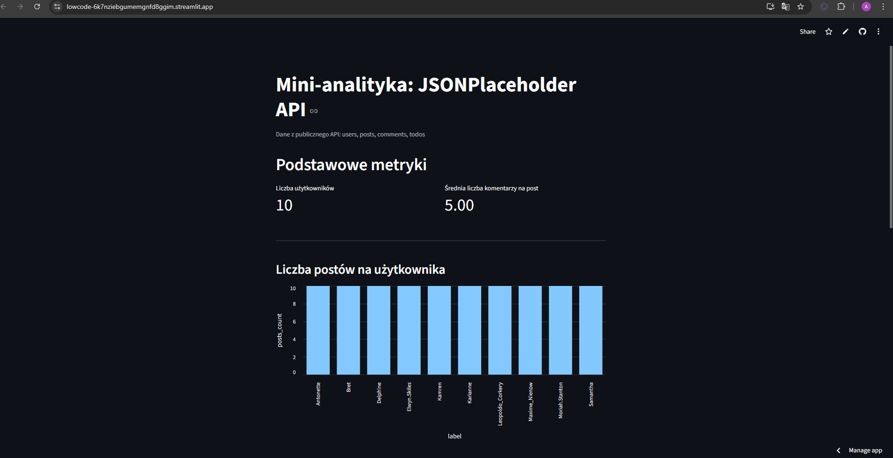

# Mini-analityka danych z JSONPlaceholder

Prosty dashboard analityczny zbudowany w Pythonie z użyciem Streamlit.  
Aplikacja pobiera dane z publicznego API: https://jsonplaceholder.typicode.com i oblicza kilka podstawowych statystyk dotyczących użytkowników, postów, komentarzy i zadań TODO.

## Funkcjonalności

Aplikacja wykorzystuje dane z endpointów:
- `/users`
- `/posts`
- `/comments`
- `/todos`

Na ich podstawie wyliczane są m.in.:
- liczba postów na użytkownika,
- średnia liczba komentarzy na post,
- procent wykonanych zadań (TODOs) per użytkownik,
- top 5 najbardziej komentowanych postów.

## Wizualizacje
W projekcie znajdują się wykresy:
- wykres słupkowy: liczba postów per użytkownik,
- wykres słupkowy: procent wykonanych TODOs,
- wykres słupkowy: top 5 najczęściej komentowanych postów.

## Podgląd aplikacji

## Demo aplikacji
 **Działająca wersja online:**  
https://lowcode-6k7nziebgumemgnfd8ggim.streamlit.app/

## Repozytorium
**GitHub:**  
https://github.com/A13ksW/LowCode

## Jak użyłem AI (ChatGPT 5.1)

Podczas realizacji projektu korzystałem/am z ChatGPT jako narzędzia pomocniczego. AI zostało użyte w następujący sposób:

- do zaplanowania struktury projektu (podział na pobieranie danych, obliczanie metryk i wizualizacje),
- do wyjaśnienia, jak działa Streamlit i jak poprawnie uruchomić aplikację lokalnie,
- do wygenerowania przykładowych fragmentów kodu oraz ich optymalizacji,
- do pomocy w debugowaniu problemów (np. konfiguracja środowiska, Git, deploy na Streamlit Cloud),
- do przygotowania szkicu pliku README.md (opis projektu, sekcje, instrukcja uruchomienia),
- do wyjaśnień krok po kroku, gdy pojawiały się błędy podczas pracy.

Wszystkie elementy projektu zostały przeze mnie uruchomione, sprawdzone i dostosowane — AI było wsparciem, a nie narzędziem tworzącym całość automatycznie.
